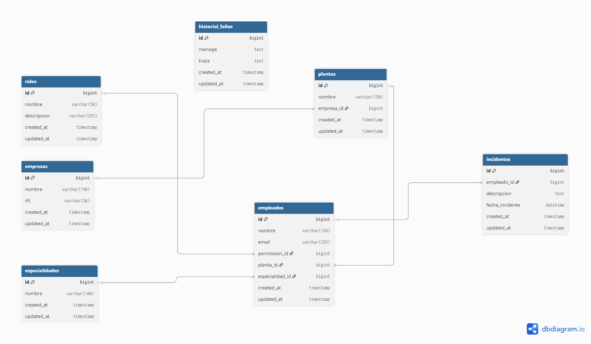

<p align="center"><a href="#" target="_blank"></a></p>

<p align="center">
<a href="#"></a>
<a href="#"></a>
<a href="#"></a>
<a href="#"></a>
</p>

## Acerca de Orienta Sync 🛡️

**Orienta Sync** es un sistema robusto de gestión de incidentes diseñado para entornos industriales. Este proyecto demuestra la implementación de arquitecturas escalables, manejo de grandes volúmenes de datos y sistemas de resiliencia en Laravel.

- **Jerarquía de Datos:** Restricción dinámica de registros basada en la ubicación del usuario (Planta).
- **Alto Rendimiento:** Procesamiento de reportes masivos (+50k registros) usando Query Builder y Memory Management.
- **Resiliencia Operativa:** Sistema de logging de fallos críticos para auditoría técnica.
- **UI/UX Premium:** Dashboard administrativo desarrollado con Tailwind CSS y enfoque en SOC (Security Operations Center).


## 📊 Modelo Entidad-Relación

A continuación se detalla la estructura lógica de la base de datos diseñada para este proyecto:




## 🚀 Instalación y Configuración

Sigue estos pasos para desplegar el proyecto localmente:

### 1. Requisitos Previos
Asegúrate de tener instaladas las extensiones de PHP: `pdo_pgsql`, `gd`, `zip`.

### 2. Clonar e Instalar
```bash
git clone https://github.com/Lalocal1210/reporte-orienta
cd reporte-orienta
composer install


3. Entorno y Base de Datos

cp .env.example .env
php artisan key:generate

Configura tus credenciales de PostgreSQL en el .env. Luego ejecuta:

Bash
php artisan migrate:fresh --seed

4. Ejecución
Bash
php artisan serve
Visita: http://127.0.0.1:8000

🔐 Simulación de Roles
El sistema incluye un Simulador de Contexto en el Header para facilitar la evaluación:

SuperAdmin: Acceso total a todas las plantas y empresas a nivel nacional.

Operador de Planta: Acceso restringido únicamente a los incidentes de su ubicación asignada.

🧠 Decisiones Técnicas
Query Builder vs ORM: Para la exportación a Excel, se evitó Eloquent para prevenir el desbordamiento de memoria (RAM) al hidratar miles de modelos, optando por consultas directas y eficientes.

Manejo de Errores: Se implementó un middleware de captura para procesos de exportación que alimenta la tabla historial_fallos, garantizando que el sistema nunca "muera" ante el usuario final.

Normalización SQL: Esquema de base de datos diseñado para integridad referencial en PostgreSQL, optimizado para reporteo cruzado.

📡 API Endpoints
GET /api/incidentes: Lista paginada con soporte de Header X-Usuario-Simulado.

GET /api/incidentes/exportar: Generación y descarga de archivo .xlsx.

